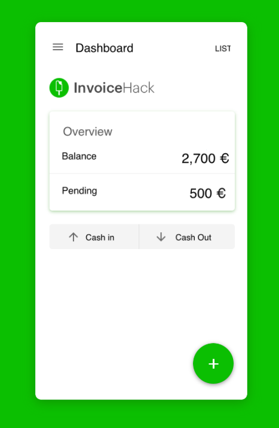
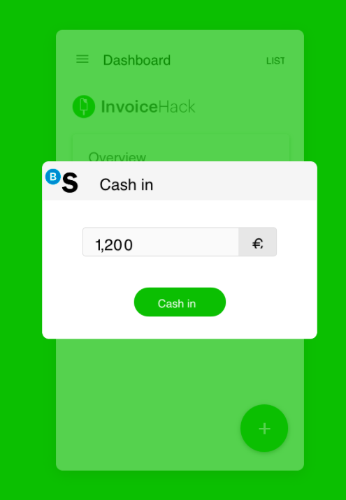
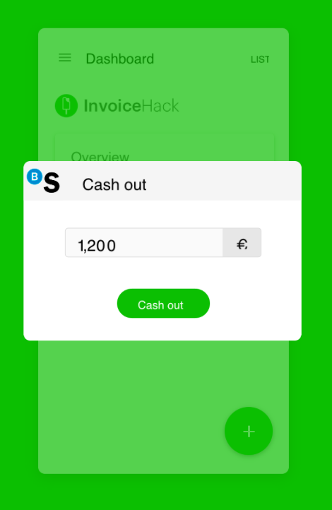
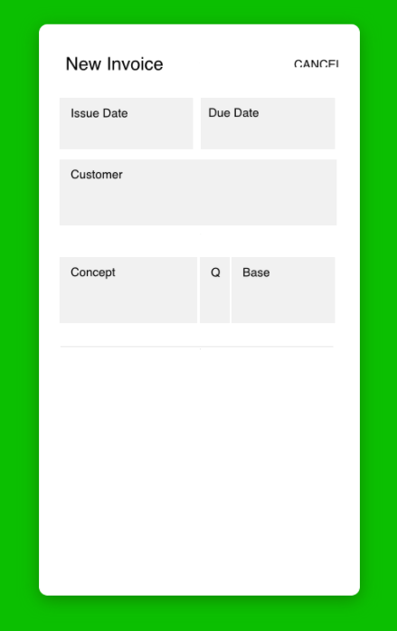
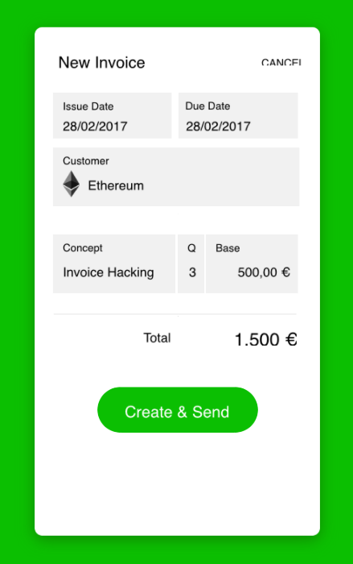
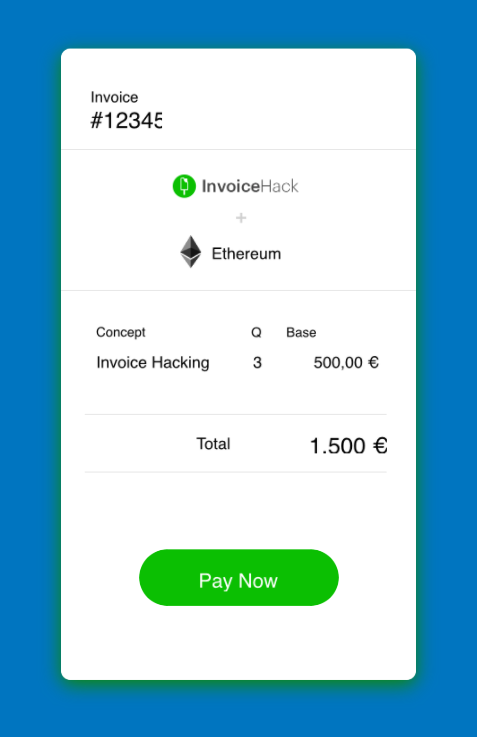
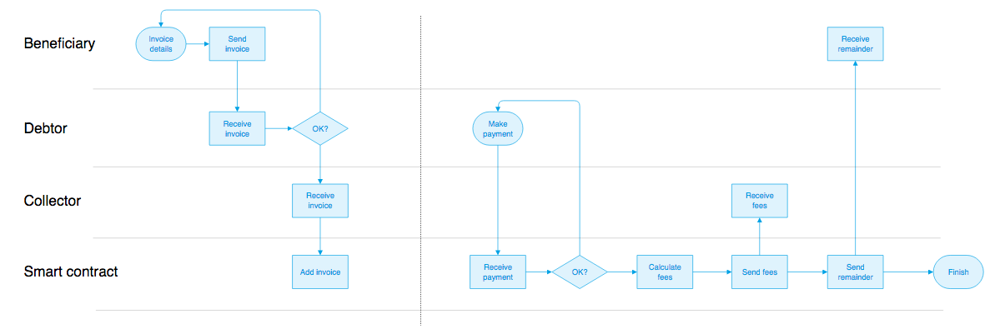

# InvoicingHack

It is a simple mobile app that allows creating invoices, send them to your customers and get paid faster through Blockchain technology.

The app connects with your Banc Sabadell account through BSTokens so that you can cash in or cash out money from your bank account to the app.

You can easily create invoices and send them to your customers so that they can pay directly from the invoice and you get paid automatically.

InvoicingHack charges you a transaction fee from every invoice that is successfully paid.

InvoicingHack is crafted by Victor Albertos, Adrián Calvo and Héctor García and Quipu Team.

## 1.- Dashboard - InvoiceHack Quipu

## 2.- Cash in - InvoiceHack Quipu

## 3.- Cash Out - InvoiceHack Quipu

## 4.- Invoice Form - InvoiceHack Quipu

## 5.- Invoice Form Send - InvoiceHack Quipu

## 6.- Invoice View Pay - InvoiceHack Quipu

## Use case execution diagram

